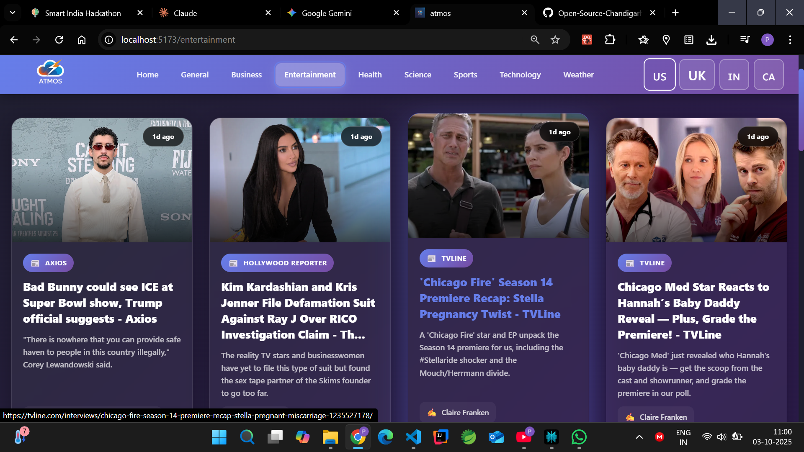
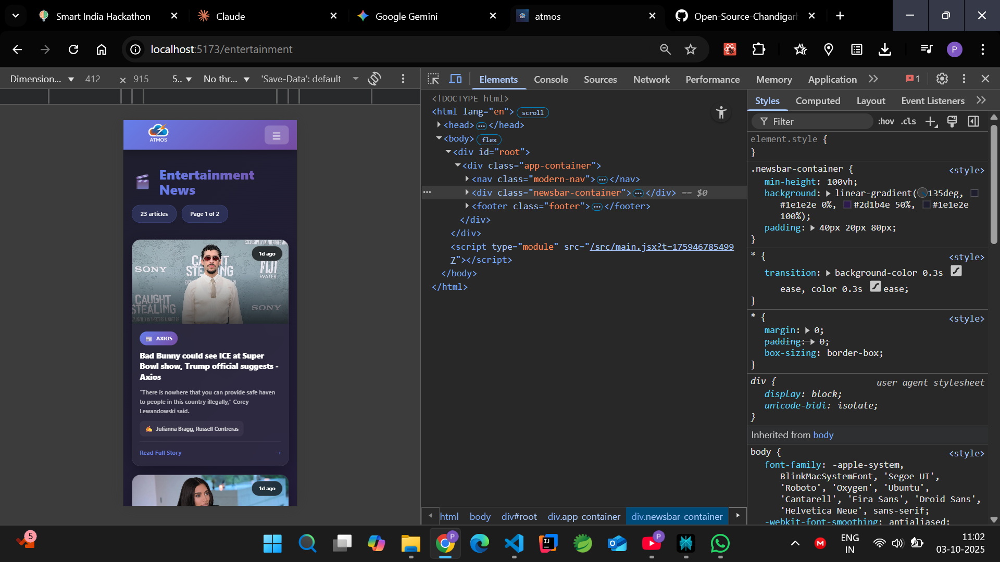

#  Atmos - Modern News Application

<div align="center">


**Stay Informed with Real-Time News from Around the World**


[](LICENSE)
[](https://reactjs.org/)
[](https://redux.js.org/)

• [Report Bug](https://github.com/Open-Source-Chandigarh/Atmos) • [Request Feature](https://github.com/Open-Source-Chandigarh/Atmos)

</div>

---

## 📸 Screenshots

### Homepage

*Modern dashboard with top stories and weather widget*

### Category News

*Browse news by categories with beautiful card layouts*

### Mobile Responsive

*Fully responsive design for all devices*

---

## ✨ Features

- 🌍 **Multi-Country Support** - News from USA, UK, India, Canada
- 📂 **Multiple Categories** - Business, Technology, Sports, Health, Science, Entertainment, General
- 🔍 **Search Functionality** - Find news articles by keywords
- 🌤️ **Weather Widget** - Real-time weather with city search
- 📱 **Fully Responsive** - Works perfectly on desktop, tablet, and mobile
- 🎨 **Modern UI/UX** - Beautiful gradient design with smooth animations
- 🔐 **Secure** - Environment variables for API keys
- ♿ **Accessible** - WCAG compliant design

---

## 🚀 Quick Start

### Prerequisites

Before you begin, ensure you have:
- Node.js (v14 or higher)
- npm or yarn
- Git

### Installation

1. **Clone the repository**
   ```bash
   git clone https://github.com/Open-Source-Chandigarh/Atmos
   cd news-app
   ```

2. **Install dependencies**
   ```bash
   npm install
   ```

3. **Set up environment variables**
   
   Create a `.env` file in the root directory:
   ```env
   VITE_NEWS_API_KEY=your_news_api_key_here
   VITE_WEATHER_API_KEY=your_weather_api_key_here
   ```

4. **Get your API keys**

   **News API:**
   - Visit [NewsAPI.org](https://newsapi.org/register)
   - Sign up for a free account
   - Copy your API key
   - Free tier: 100 requests/day

   **Weather API:**
   - Visit [OpenWeatherMap](https://openweathermap.org/api)
   - Sign up for a free account
   - Copy your API key
   - Free tier: 1,000 requests/day

5. **Start the development server**
   ```bash
   npm start
   ```

6. **Open your browser**
   
   Navigate to [http://localhost:3000](http://localhost:3000)

---

## 🛠️ Built With

| Technology | Purpose |
|------------|---------|
| [React](https://reactjs.org/) | Frontend framework |
| [Redux](https://redux.js.org/) | State management |
| [React Router](https://reactrouter.com/) | Navigation |
| [NewsAPI](https://newsapi.org/) | News data source |
| [OpenWeatherMap API](https://openweathermap.org/) | Weather data |
| [Vite](https://vitejs.dev/) | Build tool |

---

## 📁 Project Structure

```
news-app/
├── public/
│   └── index.html
├── src/
│   ├── CSS/
│   │   ├── Header.css
│   │   ├── HomePage.css
│   │   ├── HomepageNews.css
│   │   ├── FeaturedNews.css
│   │   ├── NewsBar.css
│   │   ├── NewsItem.css
│   │   ├── Weather.css
│   │   └── Footer.css
│   ├── Store/
│   │   ├── Action-creator/
│   │   │   └── index.js
│   │   ├── reducer/
│   │   │   ├── countryReducer.js
│   │   │   └── index.js
│   │   ├── store.js
│   │   └── index.js
│   ├── assets/
│   │   └── Atmos_Logo-removebg-preview.png
│   ├── App.css
│   ├── App.jsx
│   ├── Header.jsx
│   ├── Footer.jsx
│   ├── HomePage.jsx
│   ├── HomepageNews.jsx
│   ├── FeaturedNews.jsx
│   ├── NewsBar.jsx
│   ├── NewsItem.jsx
│   ├── Weather.jsx
│   ├── index.css
│   └── main.jsx
├── .env.example
├── .gitignore
├── package.json
├── vite.config.js
└── README.md
```

---

## 🎯 Usage

### Browsing News
1. **Homepage** - View top stories and weather
2. **Categories** - Click navigation links to browse by category
3. **Countries** - Use flag buttons to switch between countries
4. **Articles** - Click any article card to read full story

### Weather Widget
1. Enter any city name in the search box
2. Press Enter or click the search button
3. View current temperature, conditions, and details

### Search News
1. Use the search bar on homepage
2. Enter keywords (e.g., "technology", "bitcoin")
3. View filtered results

---

## 🔐 Environment Variables

Create a `.env` file in the root directory:

```env
# News API Key
VITE_NEWS_API_KEY=your_news_api_key_here

# Weather API Key
VITE_WEATHER_API_KEY=your_weather_api_key_here
```

⚠️ **Important:** Never commit your `.env` file to Git. It's already in `.gitignore`.

---

## 🚀 Deployment

### Deploy to Vercel (Recommended)

1. Push your code to GitHub
2. Go to [Vercel](https://vercel.com)
3. Click "New Project"
4. Import your repository
5. Add environment variables:
   - `VITE_NEWS_API_KEY`
   - `VITE_WEATHER_API_KEY`
6. Click "Deploy"

Your app will be live in ~2 minutes!

### Deploy to Netlify

1. Build your project:
   ```bash
   npm run build
   ```
2. Go to [Netlify](https://netlify.com)
3. Drag and drop the `build` folder
4. Add environment variables in site settings

### Deploy to GitHub Pages

1. Install gh-pages:
   ```bash
   npm install gh-pages --save-dev
   ```

2. Add to `package.json`:
   ```json
   "homepage": "https://yourusername.github.io/news-app",
   "scripts": {
     "predeploy": "npm run build",
     "deploy": "gh-pages -d build"
   }
   ```

3. Deploy:
   ```bash
   npm run deploy
   ```

---

## 🎨 Color Palette

```css
Primary Gradient: linear-gradient(135deg, #667eea 0%, #764ba2 100%)
Background: linear-gradient(135deg, #1e1e2e 0%, #2d1b4e 50%, #1e1e2e 100%)
Card Background: rgba(255, 255, 255, 0.05)
Text Primary: #ffffff
Text Secondary: rgba(255, 255, 255, 0.7)
```

---


## 🤝 Contributing

Contributions are welcome! Here's how you can help:

1. Fork the project
2. Create your feature branch
   ```bash
   git checkout -b feature/AmazingFeature
   ```
3. Commit your changes
   ```bash
   git commit -m 'Add some AmazingFeature'
   ```
4. Push to the branch
   ```bash
   git push origin feature/AmazingFeature
   ```
5. Open a Pull Request

### Development Guidelines
- Follow existing code style
- Test thoroughly before submitting PR
- Update README if adding new features
- Don't commit API keys or `.env` file

---

## 🐛 Known Issues

- NewsAPI free tier has rate limits (100 requests/day)
- Some news sources may not have images
- Weather API coordinates may vary for cities with same names

---

## 🔮 Future Features

- [ ] Bookmarks/Save articles
- [ ] Dark/Light mode toggle
- [ ] AI news summarizer
- [ ] Push notifications
- [ ] Social media sharing
- [ ] Reading history
- [ ] Personalized news feed
- [ ] Multi-language support
- [ ] Voice commands
- [ ] Offline mode (PWA)

---

## 📝 License

This project is licensed under the MIT License - see the [LICENSE](LICENSE) file for details.

---

## 👨‍💻 Author

**Your Name**
- GitHub: [150202-Pratham](https://github.com/150202-Pratham)
- LinkedIn: [Pratham Garg](www.linkedin.com/in/pratham-garg-11a945231)
- Email: prathamgarg1502@gmail.com

---

## 🙏 Acknowledgments

- [NewsAPI](https://newsapi.org) for providing news data
- [OpenWeatherMap](https://openweathermap.org) for weather data
- [React](https://reactjs.org) team for amazing framework
- [Redux](https://redux.js.org) for state management
- All contributors who help improve this project

---

## 📞 Support

If you have any questions or issues:
- Open an [Issue](https://github.com/Open-Source-Chandigarh/Atmos)
- Contact me on [LinkedIn](www.linkedin.com/in/pratham-garg-11a945231)
- Email: prathamgarg1502@gmail.com

---

## ⭐ Show Your Support

Give a ⭐ if this project helped you!

---

<div align="center">

**Made with ❤️ by [Pratham](https://github.com/150202-Pratham)**

[⬆ Back to Top](#-ATMOS---modern-news-application)

</div>
